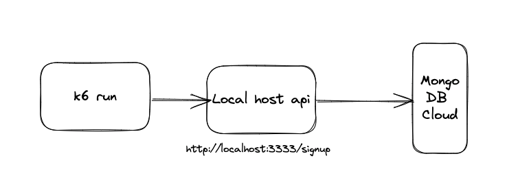

# Learning k6


## How to run the api

Create an account in mongodb cloud, create a cluster and get the credentials and put in the .env in learning-k6/api/src/.env

[Node.js](https://nodejs.org/) v16 or higher to run.

To release the Yarn package manager:

```
corepack enable
```

Run the commands below to install the project dependencies:

```sh
cd learning-k6/api
yarn install
yarn dev
```

topology:



Api and course developed by Fernando Papito [linkedin](https://www.linkedin.com/in/papitoio/)


## How to run tests using k6

[Install k6](https://k6.io/docs/get-started/installation/)

go to the test directory:

```sh
cd learning-k6/tests
```

to run the load test run the command:
```sh
k6 run signup-load.js
```

to run the smoke test run the command:
```sh
k6 run signup-smoke.js
```

to run the stress test run the command:
```sh
k6 run signup-stress.js
```